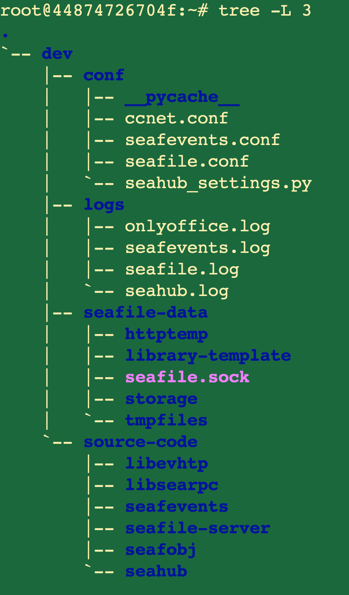

This is the document for deploying Seafile open source development environment in Ubuntu 2204 docker container.

## Create persistent directories

Login a linux server as `root` user, then:

```
mkdir -p /root/seafile-ce-docker/source-code
mkdir -p /root/seafile-ce-docker/conf
mkdir -p /root/seafile-ce-docker/logs
mkdir -p /root/seafile-ce-docker/mysql-data
mkdir -p /root/seafile-ce-docker/seafile-data/library-template
```

## Run a container

After [install docker](https://docs.docker.com/engine/install/), start a container to deploy seafile open source development environment.

```
docker run --mount type=bind,source=/root/seafile-ce-docker/source-code,target=/root/dev/source-code \
           --mount type=bind,source=/root/seafile-ce-docker/conf,target=/root/dev/conf \
           --mount type=bind,source=/root/seafile-ce-docker/logs,target=/root/dev/logs \
           --mount type=bind,source=/root/seafile-ce-docker/seafile-data,target=/root/dev/seafile-data \
           --mount type=bind,source=/root/seafile-ce-docker/mysql-data,target=/var/lib/mysql \
           -it -p 8000:8000 -p 8082:8082 -p 3000:3000 --name seafile-ce-env ubuntu:22.04 bash
```

Note, the following commands are all executed in the seafile-ce-env docker container.

## Update Source and Install Dependencies.

Update base system and install base dependencies:

```
apt-get update && apt-get upgrade -y

apt-get install -y ssh libevent-dev libcurl4-openssl-dev libglib2.0-dev uuid-dev intltool libsqlite3-dev libmysqlclient-dev libarchive-dev libtool libjansson-dev valac libfuse-dev python3-dateutil cmake re2c flex sqlite3 python3-pip python3-simplejson git libssl-dev libldap2-dev libonig-dev vim vim-scripts wget cmake gcc autoconf automake mysql-client librados-dev libxml2-dev curl sudo telnet netcat unzip netbase ca-certificates apt-transport-https build-essential libxslt1-dev libffi-dev libpcre3-dev libz-dev xz-utils nginx pkg-config poppler-utils libmemcached-dev sudo ldap-utils libldap2-dev libjwt-dev
```

Install Node 16 from nodesource:

```
curl -fsSL https://deb.nodesource.com/gpgkey/nodesource-repo.gpg.key | sudo gpg --dearmor -o /etc/apt/keyrings/nodesource.gpg
echo "deb [signed-by=/etc/apt/keyrings/nodesource.gpg] https://deb.nodesource.com/node_16.x nodistro main" | sudo tee /etc/apt/sources.list.d/nodesource.list
apt-get install -y nodejs
```

Install other Python 3 dependencies:

```
apt-get install -y python3 python3-dev python3-pip python3-setuptools python3-ldap

python3 -m pip install --upgrade pip

pip3 install Django==4.2.* django-statici18n==2.3.* django_webpack_loader==1.7.* django_picklefield==3.1 django_formtools==2.4 django_simple_captcha==0.6.* djangosaml2==1.5.* djangorestframework==3.14.* python-dateutil==2.8.* pyjwt==2.6.* pycryptodome==3.16.* python-cas==1.6.* pysaml2==7.2.* requests==2.28.* requests_oauthlib==1.3.* future==0.18.* gunicorn==20.1.* mysqlclient==2.1.* qrcode==7.3.* pillow==10.2.* chardet==5.1.* cffi==1.15.1 captcha==0.5.* openpyxl==3.0.* Markdown==3.4.* bleach==5.0.* python-ldap==3.4.* sqlalchemy==2.0.18 redis mock pytest pymysql configparser pylibmc django-pylibmc nose exam splinter pytest-django
```

## Install MariaDB and Create Databases

```
apt-get install -y mariadb-server
service mariadb start
mysqladmin -u root password 123456
```

sql for create databases

```
mysql -uroot -p123456 -e "CREATE DATABASE ccnet CHARACTER SET utf8;"
mysql -uroot -p123456 -e "CREATE DATABASE seafile CHARACTER SET utf8;"
mysql -uroot -p123456 -e "CREATE DATABASE seahub CHARACTER SET utf8;"
```

## Download Source Code

```
cd ~/
cd ~/dev/source-code

git clone https://github.com/haiwen/libevhtp.git
git clone https://github.com/haiwen/libsearpc.git
git clone https://github.com/haiwen/seafile-server.git
git clone https://github.com/haiwen/seafevents.git
git clone https://github.com/haiwen/seafobj.git
git clone https://github.com/haiwen/seahub.git

cd libevhtp/
git checkout tags/1.1.7 -b tag-1.1.7

cd ../libsearpc/
git checkout tags/v3.3-latest -b tag-v3.3-latest

cd ../seafile-server
git checkout tags/v11.0.5-server -b tag-v11.0.5-server

cd ../seafevents
git checkout tags/v11.0.5-server -b tag-v11.0.5-server

cd ../seafobj
git checkout tags/v11.0.5-server -b tag-v11.0.5-server

cd ../seahub
git checkout tags/v11.0.5-server -b tag-v11.0.5-server
```

## Compile and Install seaf-server

```
cd ../libevhtp
cmake -DEVHTP_DISABLE_SSL=ON -DEVHTP_BUILD_SHARED=OFF .
make
make install
ldconfig

cd ../libsearpc
./autogen.sh
./configure
make
make install
ldconfig

cd ../seafile-server
./autogen.sh
./configure --disable-fuse
make
make install
ldconfig
```

## Create Conf Files

```
cd ~/dev/conf

cat > ccnet.conf  <<EOF
[Database]
ENGINE = mysql
HOST = localhost
PORT = 3306
USER = root
PASSWD = 123456
DB = ccnet
CONNECTION_CHARSET = utf8
CREATE_TABLES = true
EOF

cat > seafile.conf  <<EOF
[database]
type = mysql
host = localhost
port = 3306
user = root
password = 123456
db_name = seafile
connection_charset = utf8
create_tables = true
EOF

cat > seafevents.conf  <<EOF
[DATABASE]
type = mysql
username = root
password = 123456
name = seahub
host = localhost
EOF

cat > seahub_settings.py  <<EOF
DATABASES = {
    'default': {
        'ENGINE': 'django.db.backends.mysql',
        'NAME': 'seahub',
        'USER': 'root',
        'PASSWORD': '123456',
        'HOST': 'localhost',
        'PORT': '3306',
    }
}
FILE_SERVER_ROOT = 'http://127.0.0.1:8082'
SERVICE_URL = 'http://127.0.0.1:8000'
EOF
```

## Start seaf-server

```
seaf-server -F /root/dev/conf -d /root/dev/seafile-data -l /root/dev/logs/seafile.log >> /root/dev/logs/seafile.log 2>&1 &
```

## Start seafevents and seahub 

### Prepare environment variables

```
export CCNET_CONF_DIR=/root/dev/conf
export SEAFILE_CONF_DIR=/root/dev/seafile-data
export SEAFILE_CENTRAL_CONF_DIR=/root/dev/conf
export SEAHUB_DIR=/root/dev/source-code/seahub
export SEAHUB_LOG_DIR=/root/dev/logs
export PYTHONPATH=/usr/local/lib/python3.10/dist-packages/:/usr/local/lib/python3.10/site-packages/:/root/dev/source-code/:/root/dev/source-code/seafobj/:/root/dev/source-code/seahub/thirdpart:$PYTHONPATH
```

### Start seafevents

```
cd /root/dev/source-code/seafevents/
python3 main.py --loglevel=debug --logfile=/root/dev/logs/seafevents.log --config-file /root/dev/conf/seafevents.conf >> /root/dev/logs/seafevents.log 2>&1 &
```

### Start seahub

#### Create seahub database tables

```
cd /root/dev/source-code/seahub/
python3 manage.py migrate
```

#### Create user

```
python3 manage.py createsuperuser
```

#### Start seahub

```
python3 manage.py runserver 0.0.0.0:8000
```

Then, you can visit <http://127.0.0.1:8000/>  to use Seafile.

## The Final Directory Structure



## More

### Deploy Frontend Development Environment

For deploying frontend development enviroment, you need:

1, checkout seahub to master branch

```
cd /root/dev/source-code/seahub

git fetch origin master:master
git checkout master
```

2, add the following configration to /root/dev/conf/seahub_settings.py

```
import os
PROJECT_ROOT = '/root/dev/source-code/seahub'
WEBPACK_LOADER = {
    'DEFAULT': {
        'BUNDLE_DIR_NAME': 'frontend/',
        'STATS_FILE': os.path.join(PROJECT_ROOT,
                                   'frontend/webpack-stats.dev.json'),
    }
}
DEBUG = True
```

3, install js modules

```
cd /root/dev/source-code/seahub/frontend

npm install
```

4, npm run dev

```
cd /root/dev/source-code/seahub/frontend

npm run dev
```

5, start seaf-server and seahub
